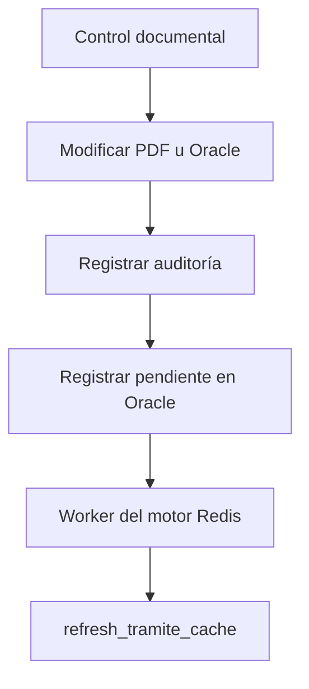

## Guía para el programador: integración de Control documental con Redis

El módulo de **Control documental** ya convive con un motor Redis independiente incluido en el proyecto. El programador no debe crear otro motor ni reconstruir toda la solución: debe conectar las operaciones documentales existentes con el refresco incremental por trámite.

### 1. Componentes que ya existen

Dentro del proyecto están estos componentes:

|Archivo|Función|
|---|---|
|`fastapi_app/app.py`|Aplicación principal y proceso de Control documental|
|`motor_redis/app.py`|API del motor Redis, normalmente en el puerto `8090`|
|`motor_redis/core.py`|Consultas a Oracle, manejo de claves Redis y refresco de trámites|
|`motor_redis/worker.py`|Worker que recibe trabajos de actualización|
|`motor_redis/deploy/motor-redis-api.service`|Servicio de la API Redis|
|`motor_redis/deploy/motor-redis-worker@.service`|Servicio del worker Redis|

El motor maneja esta cola:

```text
dig:v1:jobs
```

Y ya reconoce este tipo de trabajo:

```json
{
  "job": "warm_tramite",
  "tramite": 6101455,
  "anio_desde": "2026",
  "anio_hasta": "2026"
}
```

El worker llama a esta función existente:

```python
refresh_tramite_cache(
    tramite=6101455,
    anio_desde="2026",
    anio_hasta="2026"
)
```

Esta función actualiza únicamente:

- El registro del trámite obtenido desde Oracle.
    
- Las carpetas del trámite.
    
- Los nombres de sus PDFs.
    
- Tamaños y fechas de modificación.
    
- Los índices Redis asociados con ese trámite.
    

No recorre nuevamente todo el repositorio.

---

## 2. Qué debe implementarse

La aplicación de Control documental no debería actualizar directamente todas las claves Redis.

El flujo recomendado es:



Oracle conservará la solicitud pendiente. Esto garantiza que, si Redis está detenido, el trámite podrá sincronizarse posteriormente.

---

## 3. Tabla de sincronización en Oracle

Debe crearse la siguiente tabla en el esquema `DIGITALIZACION`:

```sql
CREATE TABLE DIGITALIZACION.CD_REDIS_SYNC (
    DIG_TRAMITE        NUMBER(12)    NOT NULL,
    DIG_ANIO           VARCHAR2(4)   NOT NULL,

    REQUEST_VERSION    NUMBER        DEFAULT 1 NOT NULL,
    CLAIMED_VERSION    NUMBER        DEFAULT 0 NOT NULL,
    PROCESSED_VERSION  NUMBER        DEFAULT 0 NOT NULL,

    STATUS             VARCHAR2(15)  DEFAULT 'PENDING' NOT NULL,
    LAST_OPERATION     VARCHAR2(30),

    REQUESTED_AT       TIMESTAMP     DEFAULT SYSTIMESTAMP NOT NULL,
    STARTED_AT         TIMESTAMP,
    PROCESSED_AT       TIMESTAMP,
    NEXT_RETRY_AT      TIMESTAMP,

    ATTEMPTS           NUMBER        DEFAULT 0 NOT NULL,
    WORKER_ID          VARCHAR2(100),
    LAST_ERROR         VARCHAR2(2000),

    CONSTRAINT PK_CD_REDIS_SYNC
        PRIMARY KEY (DIG_TRAMITE, DIG_ANIO),

    CONSTRAINT CK_CD_REDIS_SYNC_STATUS
        CHECK (
            STATUS IN (
                'PENDING',
                'PROCESSING',
                'DONE',
                'ERROR'
            )
        )
);
```

Índice para el worker:

```sql
CREATE INDEX DIGITALIZACION.IX_CD_REDIS_SYNC_01
    ON DIGITALIZACION.CD_REDIS_SYNC (
        STATUS,
        NEXT_RETRY_AT,
        REQUESTED_AT
    );
```

La clave primaria se forma con trámite y año. Por tanto, diez cambios sobre el mismo trámite no generarán diez filas: incrementarán la versión de una sola fila.

---

## 4. Procedimiento Oracle para registrar cambios

```sql
CREATE OR REPLACE PROCEDURE DIGITALIZACION.P_CD_ENCOLA_REDIS (
    P_TRAMITE   IN NUMBER,
    P_ANIO      IN VARCHAR2,
    P_OPERACION IN VARCHAR2
) AS
BEGIN
    IF P_TRAMITE IS NULL OR P_TRAMITE <= 0 THEN
        RAISE_APPLICATION_ERROR(
            -20001,
            'El trámite es obligatorio'
        );
    END IF;

    IF NOT REGEXP_LIKE(P_ANIO, '^[0-9]{4}$') THEN
        RAISE_APPLICATION_ERROR(
            -20002,
            'El año debe tener formato YYYY'
        );
    END IF;

    MERGE INTO DIGITALIZACION.CD_REDIS_SYNC D
    USING (
        SELECT P_TRAMITE AS DIG_TRAMITE,
               P_ANIO AS DIG_ANIO
          FROM DUAL
    ) S
    ON (
        D.DIG_TRAMITE = S.DIG_TRAMITE
        AND D.DIG_ANIO = S.DIG_ANIO
    )
    WHEN MATCHED THEN
        UPDATE SET
            D.REQUEST_VERSION = D.REQUEST_VERSION + 1,
            D.STATUS           = 'PENDING',
            D.LAST_OPERATION   = SUBSTR(P_OPERACION, 1, 30),
            D.REQUESTED_AT     = SYSTIMESTAMP,
            D.NEXT_RETRY_AT    = NULL,
            D.LAST_ERROR       = NULL
    WHEN NOT MATCHED THEN
        INSERT (
            DIG_TRAMITE,
            DIG_ANIO,
            REQUEST_VERSION,
            CLAIMED_VERSION,
            PROCESSED_VERSION,
            STATUS,
            LAST_OPERATION,
            REQUESTED_AT,
            ATTEMPTS
        )
        VALUES (
            P_TRAMITE,
            P_ANIO,
            1,
            0,
            0,
            'PENDING',
            SUBSTR(P_OPERACION, 1, 30),
            SYSTIMESTAMP,
            0
        );

EXCEPTION
    WHEN DUP_VAL_ON_INDEX THEN
        UPDATE DIGITALIZACION.CD_REDIS_SYNC
           SET REQUEST_VERSION = REQUEST_VERSION + 1,
               STATUS          = 'PENDING',
               LAST_OPERATION  = SUBSTR(P_OPERACION, 1, 30),
               REQUESTED_AT    = SYSTIMESTAMP,
               NEXT_RETRY_AT   = NULL,
               LAST_ERROR      = NULL
         WHERE DIG_TRAMITE = P_TRAMITE
           AND DIG_ANIO = P_ANIO;
END;
/
```

El procedimiento no debe ejecutar `COMMIT`. La confirmación debe realizarla la operación principal de Control documental.

---

## 5. Función Python para llamar al procedimiento

En `fastapi_app/app.py` debe agregarse una única función centralizada:

```python
def _cd_request_redis_sync(
    *,
    connection,
    tramite: int,
    anio: str,
    operation: str,
) -> None:
    cursor = connection.cursor()
    try:
        cursor.execute(
            """
            BEGIN
                DIGITALIZACION.P_CD_ENCOLA_REDIS(
                    ?, ?, ?
                );
            END;
            """,
            (
                int(tramite),
                str(anio),
                str(operation)[:30],
            ),
        )
    finally:
        cursor.close()
```

Si la aplicación usa una conexión Oracle nueva:

```python
def _cd_register_redis_pending(
    *,
    tramite: int,
    anio: str,
    operation: str,
) -> None:
    connection = _oracle_connect()
    try:
        _cd_request_redis_sync(
            connection=connection,
            tramite=tramite,
            anio=anio,
            operation=operation,
        )
        connection.commit()
    except Exception:
        connection.rollback()
        raise
    finally:
        connection.close()
```

Cuando ya exista una transacción Oracle abierta, debe reutilizarse esa conexión para que el cambio documental y la solicitud de sincronización se confirmen juntos.

---

## 6. Funciones de Control documental que deben modificarse

En `fastapi_app/app.py` existen las siguientes funciones:

|Ruta o función|Cambio solicitado|
|---|---|
|`cd_upload_multi()`|Registrar `UPLOAD_PDF`|
|`cd_rename_pdf()`|Registrar `RENAME_PDF`|
|`cd_delete_pdf()`|Registrar `DELETE_PDF`|
|`cd_set_estado()`|Registrar `CHANGE_STATUS`|
|`ui_control_doc_unlock_tramite_post()`|Registrar `UNLOCK_REVIEW`|
|`ui_control_doc_change_review_post()`|Registrar `CHANGE_REVIEW`|
|`ui_cd_bulk_review_upload()`|Registrar los trámites modificados|
|`ui_control_doc_bulk_unlock_range_execute()`|Registrar los trámites desbloqueados|
|`ui_control_doc_bulk_unlock_range_revert()`|Registrar los trámites revertidos|

La observación solamente necesita refresco si forma parte de la información almacenada en Redis.

### Ejemplo para una carga

```python
# 1. El PDF ya fue validado y guardado correctamente.
guardar_pdf(...)

# 2. Se registra la auditoría.
registrar_auditoria(...)

# 3. Se registra el refresco pendiente en Oracle.
_cd_register_redis_pending(
    tramite=tramite,
    anio=anio,
    operation="UPLOAD_PDF",
)

# 4. Se responde al usuario.
```

### Ejemplo para eliminación

```python
eliminar_pdf(...)

_cd_register_redis_pending(
    tramite=tramite,
    anio=anio,
    operation="DELETE_PDF",
)
```

El refresco nunca debe registrarse antes de que la operación sobre el archivo haya terminado correctamente.

---

## 7. Tratamiento de operaciones masivas

No debe llamarse a Oracle después de cada PDF. Debe recopilarse el conjunto de trámites afectados:

```python
tramites_afectados: set[tuple[int, str]] = set()

for archivo in archivos:
    resultado = procesar_archivo(archivo)

    if resultado.correcto:
        tramites_afectados.add(
            (
                int(resultado.tramite),
                str(resultado.anio),
            )
        )
```

Al finalizar:

```python
connection = _oracle_connect()

try:
    for tramite, anio in tramites_afectados:
        _cd_request_redis_sync(
            connection=connection,
            tramite=tramite,
            anio=anio,
            operation="MASS_UPLOAD",
        )

    connection.commit()

except Exception:
    connection.rollback()
    raise

finally:
    connection.close()
```

Esto genera una sola actualización por trámite, aunque se hayan copiado varios PDFs.

---

## 8. Modificación del worker Redis

El archivo `motor_redis/worker.py` actualmente espera trabajos en:

```text
dig:v1:jobs
```

Debe ampliarse para consultar también `DIGITALIZACION.CD_REDIS_SYNC`.

El ciclo quedaría conceptualmente así:

```python
def main() -> None:
    logger.info("DIGITALIZACION cache worker started")

    while running:
        # Trabajos que ya llegan directamente por Redis.
        item = cache.client.brpop(
            "dig:v1:jobs",
            timeout=2,
        )

        if item:
            try:
                handle(json.loads(item[1]))
            except Exception:
                logger.exception("Redis cache job failed")

        # Trabajos persistentes registrados en Oracle.
        try:
            process_control_documental_pending()
        except Exception:
            logger.exception(
                "Control documental Redis sync failed"
            )
```

### Reclamar una fila pendiente

El worker debe:

1. Bloquear una fila pendiente.
    
2. Copiar `REQUEST_VERSION` en `CLAIMED_VERSION`.
    
3. Marcarla como `PROCESSING`.
    
4. Confirmar la transacción.
    
5. Ejecutar el refresco sin mantener bloqueada la fila.
    

Consulta base para Oracle 11g:

```sql
SELECT DIG_TRAMITE,
       DIG_ANIO,
       REQUEST_VERSION
  FROM DIGITALIZACION.CD_REDIS_SYNC
 WHERE STATUS IN ('PENDING', 'ERROR')
   AND REQUEST_VERSION > PROCESSED_VERSION
   AND (
       NEXT_RETRY_AT IS NULL
       OR NEXT_RETRY_AT <= SYSTIMESTAMP
   )
   AND ROWNUM <= 1
 FOR UPDATE SKIP LOCKED
```

Después de obtenerla:

```sql
UPDATE DIGITALIZACION.CD_REDIS_SYNC
   SET STATUS          = 'PROCESSING',
       CLAIMED_VERSION = REQUEST_VERSION,
       STARTED_AT      = SYSTIMESTAMP,
       WORKER_ID       = :WORKER_ID,
       ATTEMPTS        = ATTEMPTS + 1
 WHERE DIG_TRAMITE = :TRAMITE
   AND DIG_ANIO = :ANIO
```

El worker confirma esa transacción y ejecuta:

```python
result = refresh_tramite_cache(
    int(tramite),
    str(anio),
    str(anio),
)
```

---

## 9. Finalización correcta

Si Redis fue actualizado:

```sql
UPDATE DIGITALIZACION.CD_REDIS_SYNC
   SET PROCESSED_VERSION = :CLAIMED_VERSION,
       STATUS =
           CASE
               WHEN REQUEST_VERSION > :CLAIMED_VERSION
               THEN 'PENDING'
               ELSE 'DONE'
           END,
       PROCESSED_AT = SYSTIMESTAMP,
       LAST_ERROR = NULL,
       NEXT_RETRY_AT = NULL
 WHERE DIG_TRAMITE = :TRAMITE
   AND DIG_ANIO = :ANIO
```

La comparación de versiones es importante. Si otro usuario modifica el mismo trámite mientras el worker está actualizando Redis, `REQUEST_VERSION` aumentará y el trámite volverá a quedar pendiente.

---

## 10. Tratamiento de errores y reintentos

Si falla Redis o el escaneo del trámite:

```sql
UPDATE DIGITALIZACION.CD_REDIS_SYNC
   SET STATUS = 'ERROR',
       LAST_ERROR = SUBSTR(:ERROR, 1, 2000),
       NEXT_RETRY_AT =
           SYSTIMESTAMP
           + NUMTODSINTERVAL(
               LEAST(300, POWER(2, LEAST(ATTEMPTS, 8))),
               'SECOND'
           )
 WHERE DIG_TRAMITE = :TRAMITE
   AND DIG_ANIO = :ANIO
```

El worker debe reintentar progresivamente sin perder la operación.

La carga, eliminación o revisión documental no debe revertirse porque Redis esté temporalmente fuera de servicio. Oracle mantendrá el pendiente.

---

## 11. Claves Redis que ya actualiza el motor

El programador de Control documental no necesita modificarlas directamente. `refresh_tramite_cache()` se encarga de actualizar:

```text
dig:v1:full:rows
dig:v1:full:ids
dig:v1:full:tramite
dig:v1:fs:dirs
dig:v1:fs:pdfs
dig:v1:fs:tramite-dirs
dig:v1:fs:tramite-pdfs:{anio}:{tramite}
dig:v1:fs:meta
```

Para consultar el resultado:

```http
GET http://127.0.0.1:8090/api/filesystem/tramite/6101455
```

Para solicitar manualmente un refresco:

```http
POST http://127.0.0.1:8090/api/cache/tramite/6101455?anio_desde=2026&anio_hasta=2026
```

La respuesta será parecida a:

```json
{
  "status": "queued",
  "tramite": 6101455,
  "job_id": "identificador",
  "message": "Actualización del trámite 6101455 encolada"
}
```

El estado puede consultarse en:

```http
GET http://127.0.0.1:8090/api/cache/tramite/status/{job_id}
```

---

## 12. Mejora recomendada en `refresh_tramite_cache()`

Actualmente la función elimina primero las entradas anteriores y después recorre el filesystem. Si el recorrido falla en medio del proceso, el trámite podría quedar temporalmente vacío en Redis.

Como normalmente existen pocos PDFs por trámite, conviene:

1. Leer primero todas las carpetas y PDFs del trámite.
    
2. Preparar en memoria el nuevo contenido.
    
3. Abrir una transacción Redis.
    
4. Eliminar las entradas anteriores.
    
5. Insertar las nuevas.
    
6. Ejecutar todo con `MULTI/EXEC`.
    

Para el refresco parcial debería utilizarse:

```python
pipe = cache.client.pipeline(transaction=True)
```

Esto permitirá que los usuarios vean la versión anterior o la nueva, pero no un estado intermedio.

---

## 13. Seguridad del motor Redis

Redis debe permanecer escuchando únicamente en:

```text
127.0.0.1:6379
```

El servicio de la API actualmente está configurado en el puerto `8090`. Si solamente será utilizado por la aplicación del mismo servidor, debería escuchar en:

```text
127.0.0.1:8090
```

Si la interfaz Redis necesita acceso desde la red institucional, las rutas POST de actualización deben protegerse mediante:

- Token interno.
    
- Restricción por firewall.
    
- Validación de IP.
    
- Autenticación administrativa.
    

No debe dejarse públicamente disponible el endpoint que permite reconstruir cachés.

---

## 14. Pruebas de aceptación

El programador deberá comprobar estos escenarios:

1. **Carga de PDF**
    
    - Se carga un PDF desde Control documental.
        
    - Aparece una fila pendiente en `CD_REDIS_SYNC`.
        
    - El worker la procesa.
        
    - El PDF aparece en la consulta Redis.
        
    - La fila termina en `DONE`.
        
2. **Eliminación**
    
    - Se elimina un PDF.
        
    - Redis deja de mostrarlo sin recargar toda la caché.
        
3. **Renombrado**
    
    - Desaparece el nombre anterior.
        
    - Aparece el nuevo nombre.
        
4. **Cambio de revisión**
    
    - Se cambia el estado del trámite.
        
    - La información almacenada en Redis refleja el nuevo estado.
        
5. **Redis detenido**
    
    - Se detiene el motor Redis.
        
    - Se modifica un trámite.
        
    - La fila queda `PENDING` o `ERROR`.
        
    - Se inicia Redis.
        
    - El worker reintenta y termina en `DONE`.
        
6. **Varias operaciones simultáneas**
    
    - Se realizan varios cambios sobre el mismo trámite.
        
    - `REQUEST_VERSION` aumenta.
        
    - El resultado final de Redis coincide con Oracle y el disco.
        
7. **Carga masiva**
    
    - Se cargan varios PDFs de un mismo trámite.
        
    - Se registra una sola fila por trámite y año.
        

---

## Instrucción final para entregar al programador

> El proyecto ya dispone de un motor Redis separado en `motor_redis`, con una API, un worker y la función `refresh_tramite_cache()`. Para integrar Control documental, después de cada carga, eliminación, renombrado o cambio de revisión se deberá registrar en Oracle el trámite pendiente mediante `P_CD_ENCOLA_REDIS`. El worker de `motor_redis` deberá consultar `CD_REDIS_SYNC`, ejecutar el refresco únicamente para ese trámite y registrar el resultado en Oracle. No se crearán tablas SQLite nuevas, no se modificarán directamente las claves Redis desde Control documental y no se ejecutará una recarga completa después de cada operación.---
tags:
- 
---

