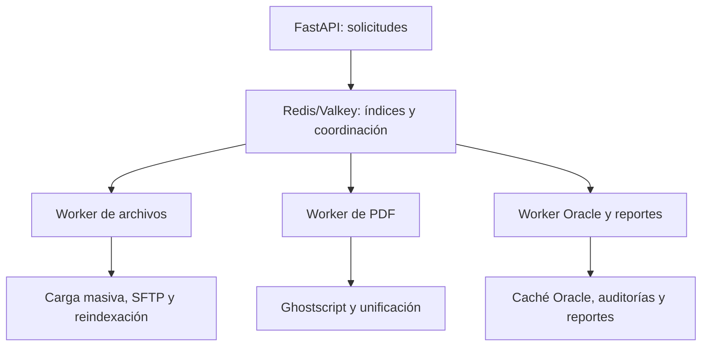

Sí, esa sería una buena evolución. Si la carga completa de Redis tarda alrededor de dos minutos, el problema ya no es su construcción, sino aprovechar ese índice para evitar que otros procesos vuelvan a recorrer 180.000 carpetas y más de un millón de PDFs.

La precisión importante es esta: Redis puede reducir búsquedas, conteos y recorridos, pero no puede evitar el trabajo físico de copiar, comprimir, unir o transferir archivos.

### Procesos que pueden reutilizar Redis

|Proceso pesado|Cómo ayudaría Redis|
|---|---|
|Carga masiva|Encontraría inmediatamente la carpeta destino por trámite, evitando cargar `folders.sqlite` completo en cada worker|
|Reporte de nombres incorrectos|Consultaría nombres y rutas indexadas, sin recorrer cada hora todo el filesystem|
|Exportación SFTP|Obtendría desde Redis las carpetas y PDFs del periodo solicitado, evitando varios `rglob()`|
|Control documental|Recuperaría carpetas y PDFs por trámite casi inmediatamente|
|Auditoría de integridad|Compararía Oracle contra el índice existente, dejando la verificación física para casos dudosos|
|Reindexación|Podría convertirse en incremental: actualizar solo trámites o carpetas modificadas|
|Carga masiva por especialidad|Resolvería miles de carpetas mediante búsquedas directas|
|Conteos y reportes|Obtendría totales por año, periodo, trámite, tipo de PDF o área sin escanear archivos|

### Lo que Redis no acelerará directamente

Redis no hará más rápida por sí solo la ejecución de:

- Ghostscript para optimizar o unir PDFs.
    
- Descompresión de ZIP.
    
- Copia física de archivos.
    
- `rsync` de todo el repositorio.
    
- Transferencia por SFTP.
    
- Cálculo SHA-256.
    

Estas operaciones seguirán dependiendo de CPU, disco y red. Sin embargo, Redis puede impedir que además realicen búsquedas y recorridos innecesarios.

### Arquitectura recomendada

No convendría levantar una instancia Redis diferente para cada proceso. Se recomienda una sola infraestructura de caché bien organizada y varios servicios especializados:



Redis podría manejar claves como:

```text
dig:v1:tramite:{numero}:folders
dig:v1:tramite:{numero}:pdfs
dig:v1:folder:{id}
dig:v1:pdf:{ruta}
dig:v1:periodo:{yyyymm}:tramites
dig:v1:job:{id}:status
dig:v1:lock:mass-upload
```

### Distribución inicial para 32 GB de RAM

|Componente|Configuración inicial|
|---|---|
|FastAPI|2 o 3 workers dedicados únicamente a solicitudes web|
|Redis/Valkey|Límite inicial de 4 a 6 GB, verificando el uso real|
|Worker de carga masiva/SFTP|1 proceso concurrente|
|Worker Ghostscript|1 proceso; posteriormente podría probarse con 2|
|Worker Oracle/Redis|1 proceso|
|Worker de reportes|1 proceso con prioridad baja|
|Sistema operativo y caché de disco|Mantener al menos 8–10 GB disponibles|

No deberían ejecutarse simultáneamente:

- Carga masiva grande.
    
- Reconstrucción completa del índice.
    
- Réplica completa SFTP.
    
- Auditoría física de todos los PDFs.
    

Todos compiten por el mismo almacenamiento. Tener más workers no necesariamente mejora el tiempo; puede disminuirlo si el disco queda saturado.

### Mejora especialmente importante

El código ya tiene una lógica equivalente a `refresh_tramite_cache`. Después de una carga masiva no sería necesario reconstruir todo Redis. El worker podría informar los trámites modificados y ejecutar:

```text
Carga ZIP
   → copia PDFs
   → registra auditoría
   → actualiza únicamente los trámites afectados en Redis
```

Así, la carga completa de dos minutos quedaría reservada para:

- Inicio del servicio.
    
- Recuperación por inconsistencias.
    
- Mantenimiento programado.
    
- Reconstrucción manual.
    

Durante la operación normal, cada carga actualizaría solamente unas pocas claves.

La mejor decisión sería convertir Redis/Valkey en el índice central de consulta y coordinación, mantener Oracle y el filesystem como fuentes oficiales, y sacar las tareas pesadas de los procesos FastAPI. Esto aportaría más que simplemente aumentar la cantidad de workers.

